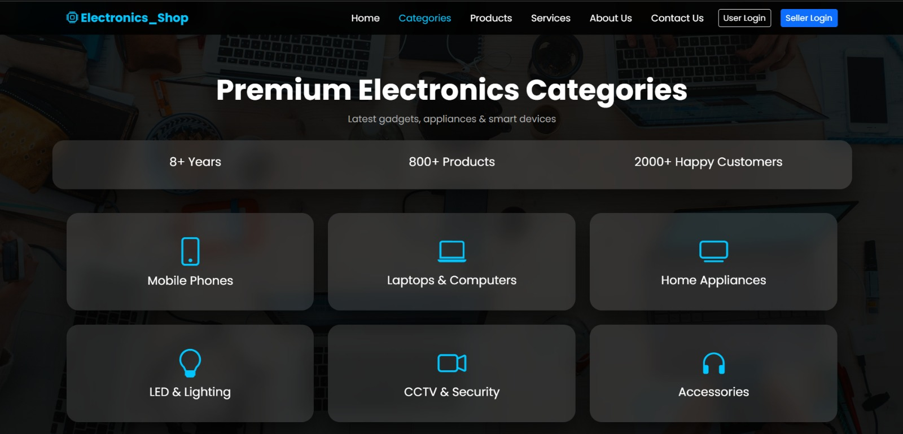
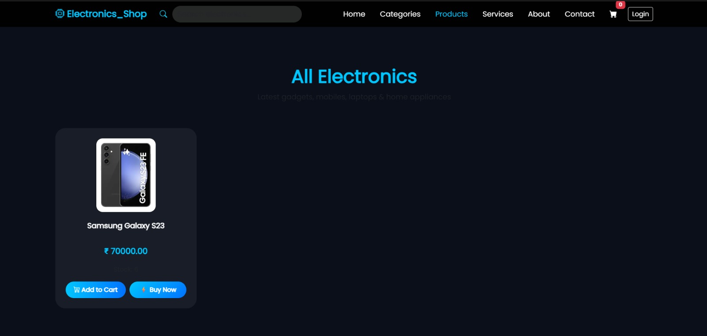

⚡ Electronic Shop Management System

A modern, scalable Electronic Shop Management System developed using Django, designed to streamline digital retail operations including product management, inventory tracking, supplier management, cart system, and order processing.

This system provides a complete end-to-end solution for managing an electronic shop efficiently in a real-world environment.

🚀 Live Demo

👉 https://elecrtonic-shop-managemage-system.onrender.com

📂 GitHub Repository

👉 https://github.com/Viral2355/ElectronicShopManagementSystem

📸 Screenshots
## 📸 Screenshots

### 🏠 Dashboard

### 📱 Products Page

### 🛒 Cart System

✨ Key Features
🔐 Secure User Authentication (Login/Register)
📦 Product & Category Management
🛒 Shopping Cart & Checkout System
🏪 Supplier / Seller Module
📊 Inventory & Stock Management
🔎 Smart Product Search & Filtering
📦 Order Management System
⚡ Responsive & Modern UI
🌐 Cloud Deployment Ready (Render)
🧱 Tech Stack
Backend: Django (Python)
Frontend: HTML, CSS, Bootstrap, JavaScript
Database: PostgreSQL / SQLite
Server: Gunicorn
Static Handling: WhiteNoise
Environment Config: python-decouple
Deployment: Render
📁 Project Structure
ElectronicShopManagementSystem/
│── manage.py
│── requirements.txt
│── electronic_shop/
│   ├── settings.py
│   ├── urls.py
│   ├── wsgi.py
│   └── shop/
│       ├── models.py
│       ├── views.py
│       ├── urls.py
│       ├── admin.py
│       └── apps.py
│── templates/
│── static/
│── media/
⚙️ Environment Variables
SECRET_KEY=your-secret-key
DEBUG=False
ALLOWED_HOSTS=.onrender.com
DATABASE_URL=your-database-url
🛠️ Installation (Local Setup)
git clone https://github.com/Viral2355/ElectronicShopManagementSystem.git
cd ElectronicShopManagementSystem

python -m venv venv
venv\Scripts\activate

pip install -r requirements.txt

python manage.py migrate
python manage.py runserver
🚀 Deployment (Render)
🔹 Build Command
pip install -r requirements.txt && python manage.py collectstatic --noinput && python manage.py migrate
🔹 Start Command
gunicorn electronic_shop.electronic_shop.wsgi:application
📌 Production Best Practices
Use environment variables (no hardcoded secrets)
Set DEBUG = False
Use PostgreSQL database
Configure WhiteNoise for static files
Set correct ALLOWED_HOSTS
🔮 Future Enhancements
💳 Online Payment Integration (Razorpay / Stripe)
📊 Sales Analytics Dashboard
📱 Mobile Application
🤖 AI-based Product Recommendation
🔔 Notification System
👨‍💻 Author

Viral Gujariya
🔗 GitHub: https://github.com/Viral2355

⭐ Support

If you like this project, give it a ⭐ on GitHub!

📄 License

This project is licensed under the MIT License.
